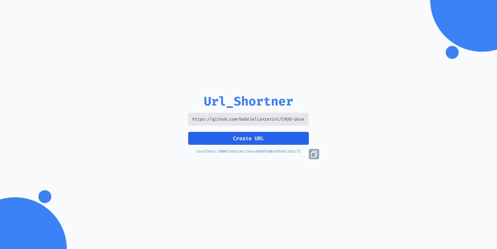

  <h1>URL_SHORTNER</h1>

# Índice

<!--ts-->
* [Descrição do Projeto](#descrição-do-projeto)
* [Funcionalidades Principais](#funcionalidades-principais)
* [Tecnologias Utilizadas](#tecnologias-utilizadas)
* [Como Utilizar](#como-utilizar)
* [Contribuindo](#contribuindo)
* [Autores](#autores)
* [Licença](#licença)
<!--te-->

## Descrição do Projeto

**URL_SHORTNER** é um incrível encurtador de links que permite transformar URLs longas em URLs curtas e amigáveis. O projeto é composto por um backend desenvolvido em Node.js utilizando o framework Express para gerenciar as solicitações HTTP e conectado a um banco de dados MongoDB para armazenar os links encurtados. Já o frontend é construído com React.js e possui uma interface moderna e responsiva estilizada com a ajuda do maravilhoso Tailwind CSS.

## Funcionalidades Principais

- Encurte URLs longas e compartilhe facilmente.
- Redirecionamento automático para a URL original quando um link encurtado é acessado.

## Tecnologias Utilizadas

- **Node.js e Express** para o backend
- **MongoDB** como banco de dados
- **React.js** para o frontend
- **Tailwind CSS** para uma estilização deslumbrante

## Como Utilizar

1. Clone este repositório em sua máquina local.
2. Instale as dependências do backend e frontend executando `npm install` em suas respectivas pastas.
3. Configure o MongoDB e atualize as credenciais de conexão no arquivo de configuração .env do backend.
4. Inicie o servidor backend com o comando `npm run dev` na pasta do backend.
5. Inicie o servidor frontend com o comando `npm start` na pasta do frontend.
6. Acesse o aplicativo em seu navegador através do link `http://localhost:3000`.

## Contribuindo

Contribuições são mais que bem-vindas! Caso encontre algum bug, tenha sugestões de melhorias ou deseje adicionar novos recursos, sinta-se à vontade para abrir uma issue ou enviar um pull request.

## Autores

Este projeto foi desenvolvido por:

- [Gabriel Henrique Antonelli Lanzarini](https://github.com/GabrielLanzarini).
- [Eduardo da Veiga](https://github.com/EduardodaVeiga)

## Licença

Este projeto está licenciado sob a Licença MIT - consulte o arquivo LICENSE.md para obter mais detalhes.

---

Obrigado por utilizar nosso encurtador de links! Esperamos que essa ferramenta seja útil para você. Em caso de dúvidas ou necessidade de ajuda, não hesite em nos contatar. Divirta-se encurtando e compartilhando seus links!

